
<h1 align="center">点餐平台网站</h1>

## 简介
点餐平台网站：角色分为管理员、用户；包括用户管理、菜品分类与信息管理、订单管理、菜品评价管理、个人中心和在线客服等功能模块，简化餐品信息管理流程，提高用户点餐体验。    --计算机毕业设计源码；毕设源码；java毕业设计源码

## 联系方式

<h3 align="center">获取完整代码与数据库文件 + 微信：deepguan QQ: 86050149 QQ群: 783742310</h3>

<h3 align="center">可帮忙远程部署 包运行成功！提供远程部署、修改代码、设计文档指导、代码讲解等服务！</h3>

## 功能介绍（完整见运行截图）
管理员： 基本功能包括登录、注册和退出，通过后台管理可以进行用户管理、菜品分类管理、菜品信息管理、菜品评价管理、订单管理、系统管理和轮播图管理等操作。管理员可以查看和编辑菜品信息，如名称、分类、材料、价格以及描述，还可以管理和审核用户评价、图形化展示评价数据和管理订单。个人中心允许管理员更新个人信息和查看操作历史。网站首页提供导航菜单，用于快速访问各种管理功能。

用户： 用户可通过登录页面进入系统，享受查阅菜品信息、浏览菜单资讯和在线客服等服务。用户可以在主页查看推荐菜品和菜品详情，并添加心仪的菜品至购物车进行结算。个人中心提供更改个人信息和查看余额、订单详情和地址管理等功能，带来便捷的体验。用户亦可对已购菜品进行评价，以供平台优化服务，并通过收藏夹管理心仪餐品。

## 运行截图

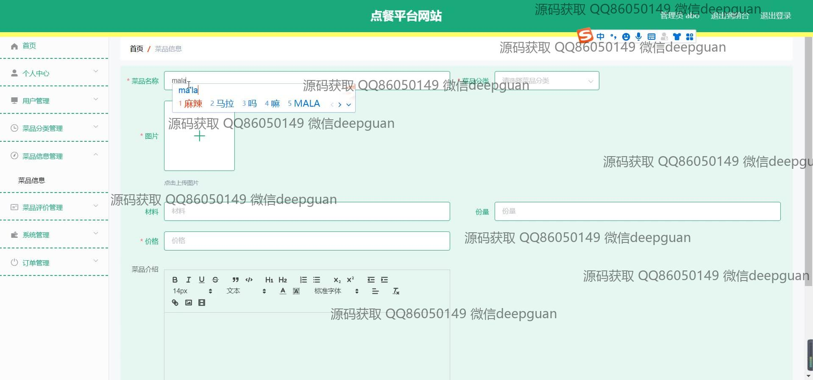
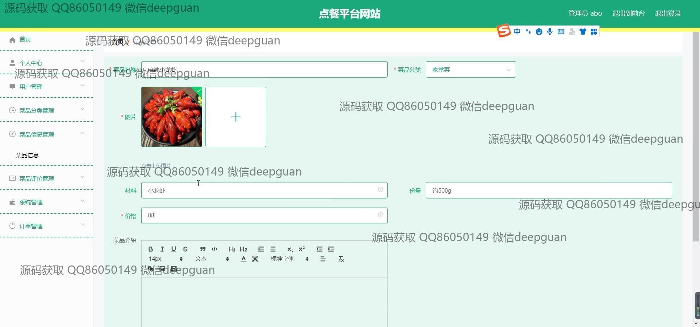
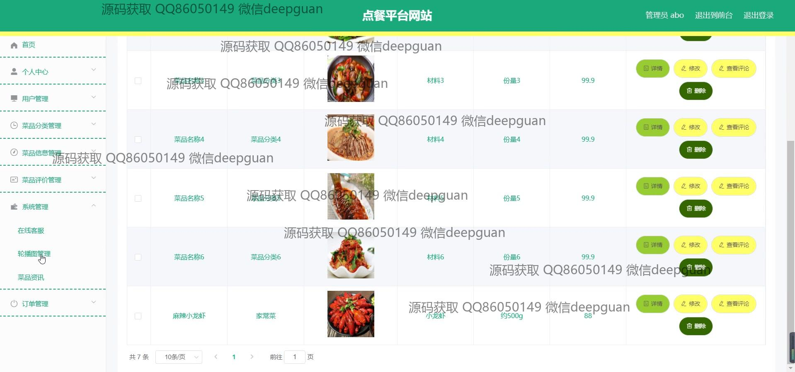
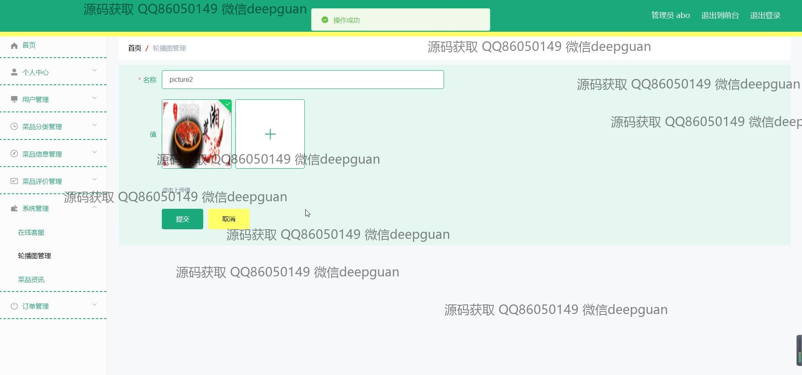
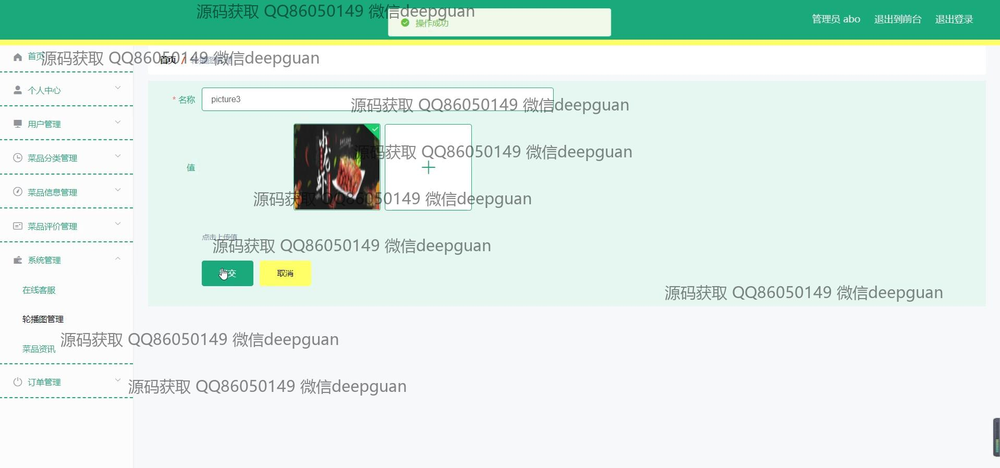
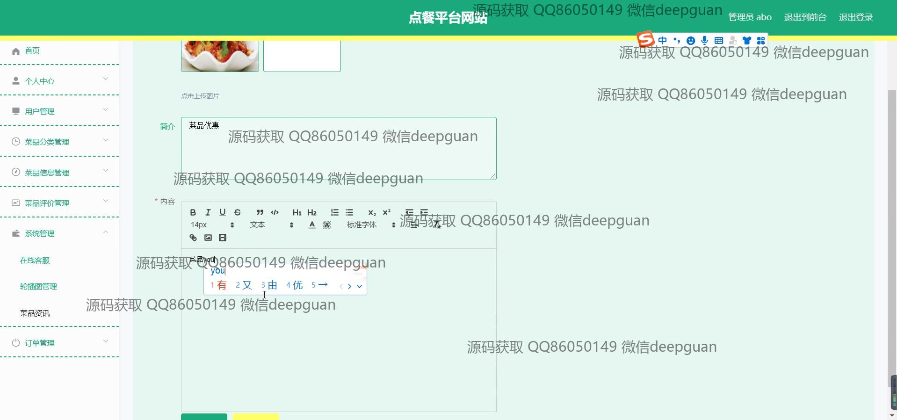
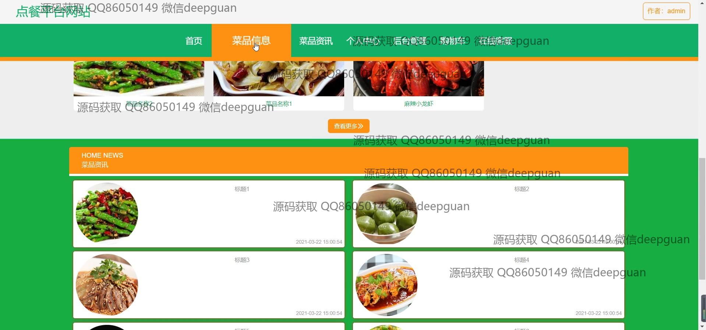
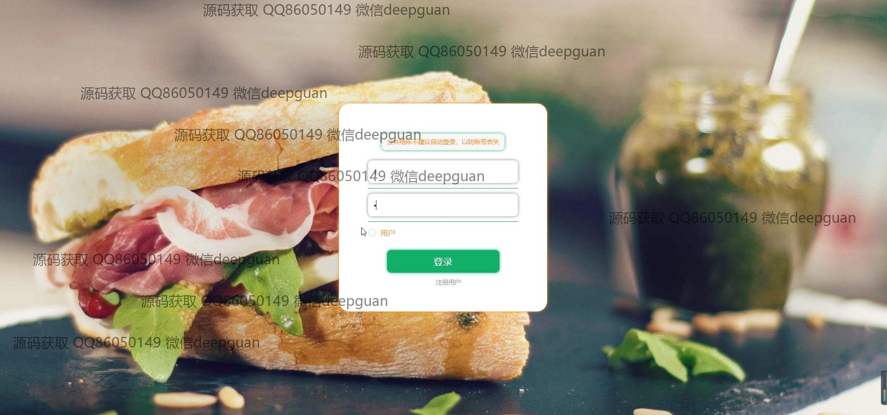
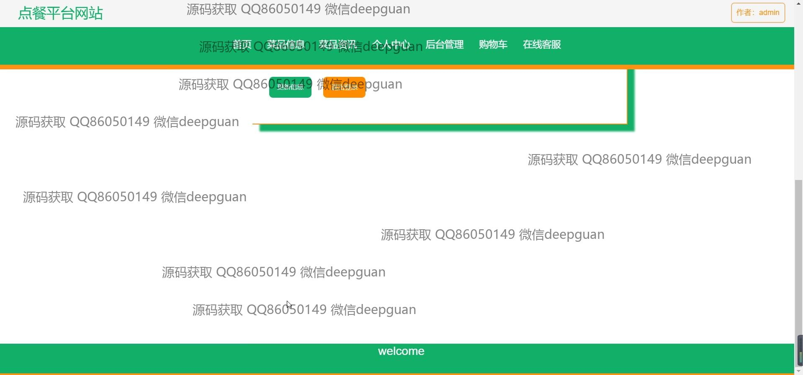
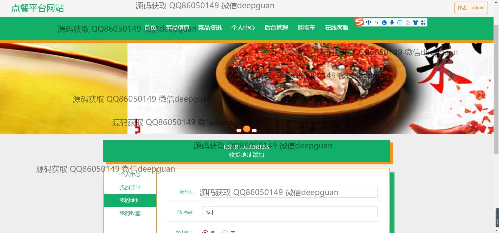
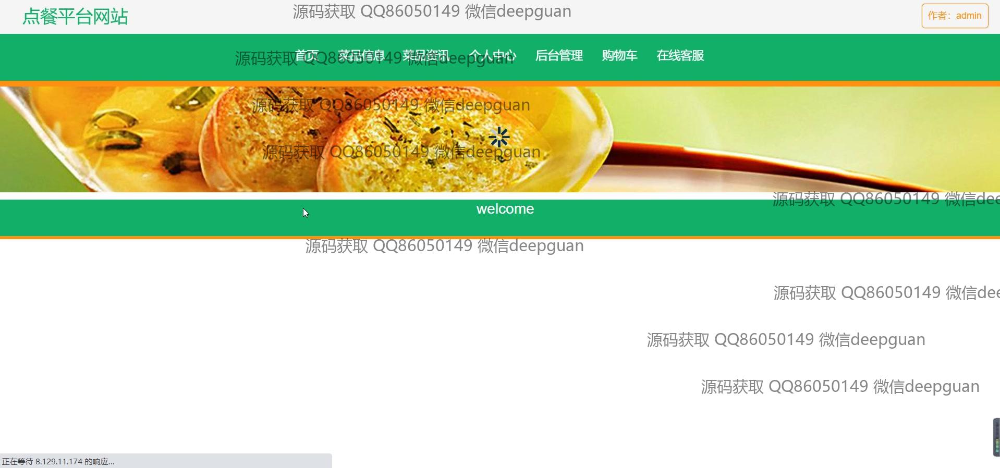
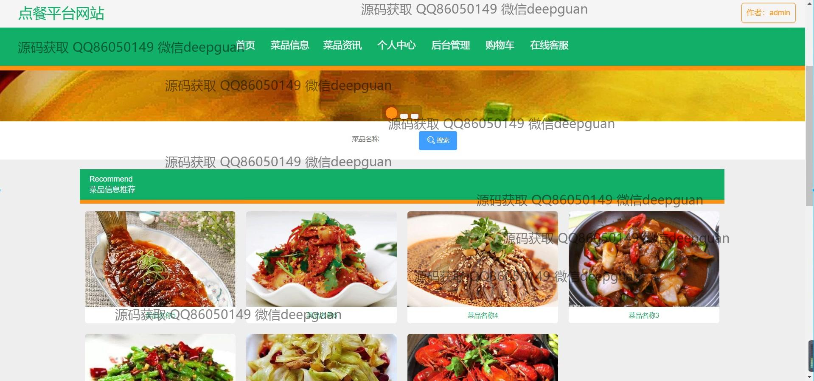
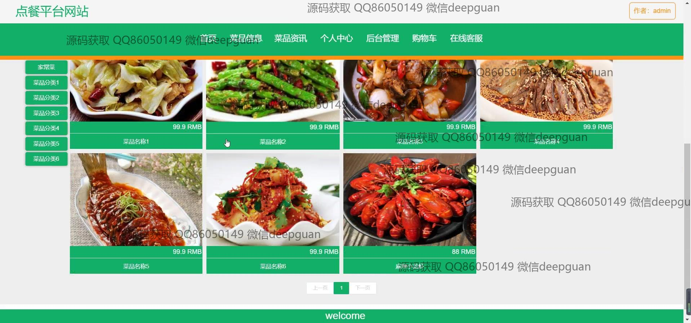
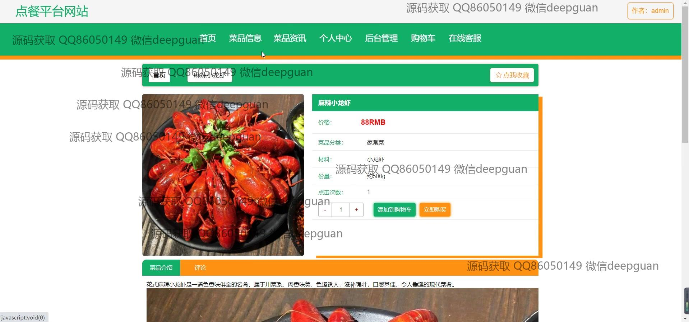
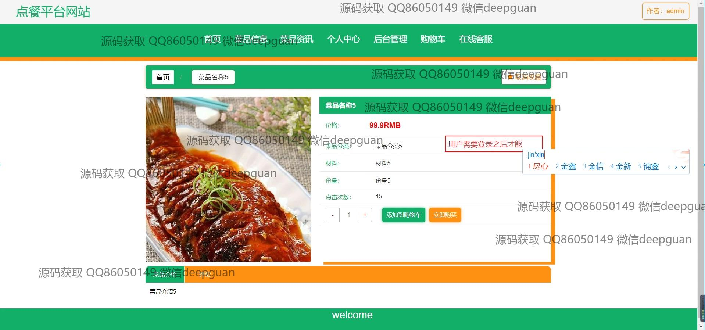

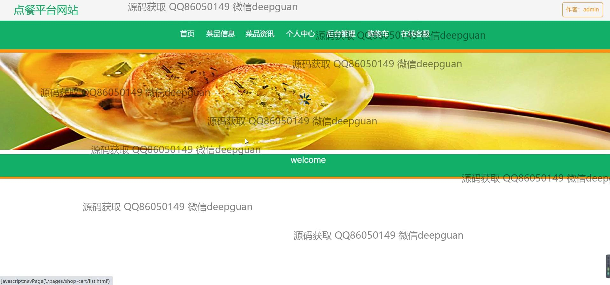
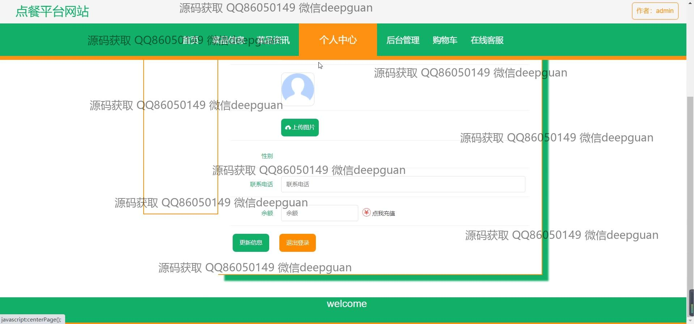
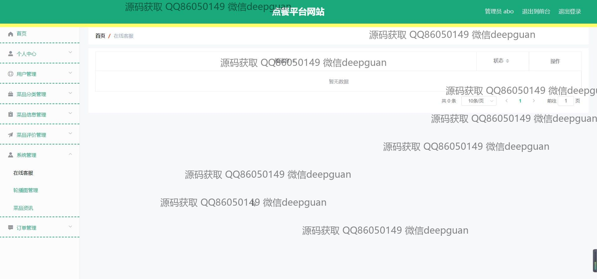
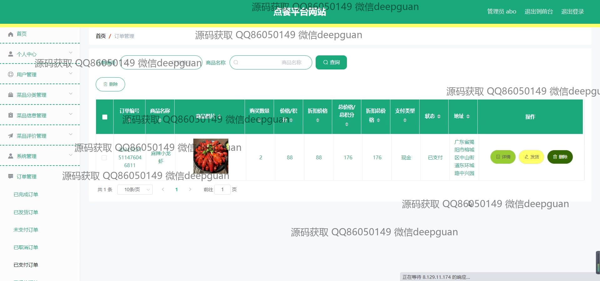
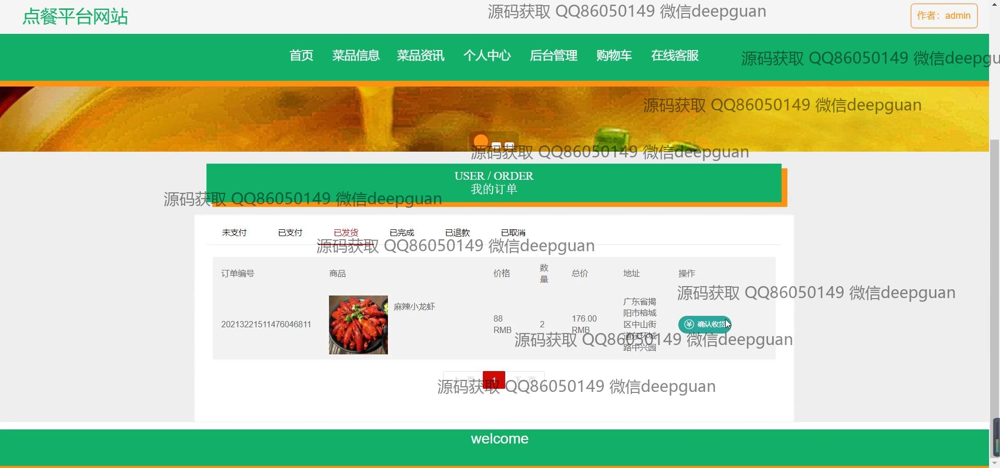

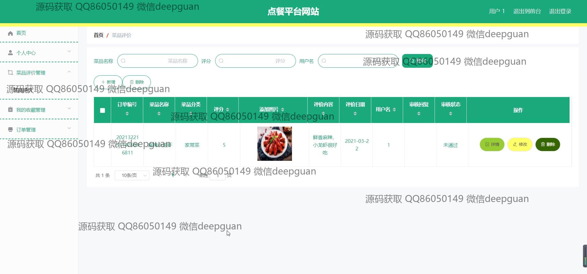

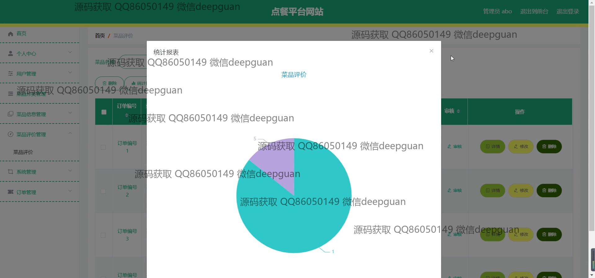

本代码来源于网络,仅供学习参考使用!

